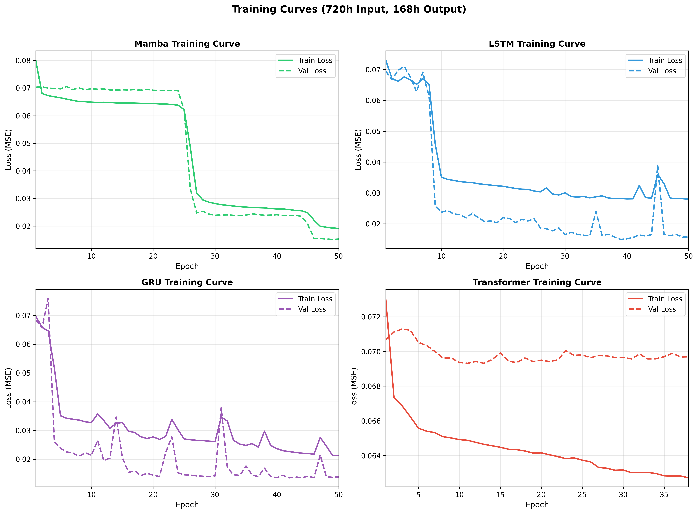
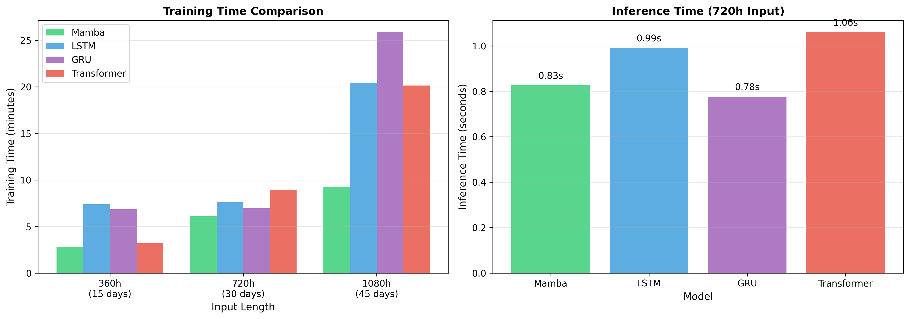

# 基于Mamba-MLEF的超长序列光伏功率预测

## 摘要

本研究针对光伏发电功率的超长序列预测任务（720小时→168小时），提出了基于Mamba架构和元学习集成框架（MLEF）的预测方法。实验表明，Mamba在超长序列建模中显著优于Transformer，而MLEF集成策略有效融合了深度学习模型和树模型的优势，实现了整体R²=0.558的最佳性能。

---

## 1. 实验设置

### 1.1 任务定义

| 项目 | 说明 |
|------|------|
| 任务类型 | 多步时序预测（Seq2Seq） |
| 输入长度 | 720小时（30天） |
| 输出长度 | 168小时（7天） |
| 特征维度 | 25维（16电气特征 + 9时间特征） |
| 时间分辨率 | 1小时 |

#### 问题形式化

给定历史观测序列 $\mathbf{X} = \{x_1, x_2, ..., x_T\}$，其中 $x_t \in \mathbb{R}^d$ 为 $t$ 时刻的 $d$ 维特征向量，目标是预测未来 $H$ 个时刻的功率序列：

$$\hat{\mathbf{Y}} = f(\mathbf{X}) = \{\hat{y}_{T+1}, \hat{y}_{T+2}, ..., \hat{y}_{T+H}\}$$

其中：
- $T = 720$（输入序列长度，30天×24小时）
- $H = 168$（预测步长，7天×24小时）
- $d = 25$（特征维度）
- $f(\cdot)$ 为预测模型

### 1.2 数据集

#### 1.2.1 数据集概览

| 项目 | 说明 |
|------|------|
| 数据来源 | 美国某光伏发电站2016年运行数据 |
| 时间范围 | 2016年1月1日 00:00 - 2016年12月31日 23:00 |
| 时间分辨率 | 1小时 |
| 原始样本数 | 8,784 (366天×24小时，含闰年) |
| 原始特征数 | 17 (1个时间戳 + 16个电气特征) |

#### 1.2.2 数据划分

| 数据集 | 月份 | 样本数 | 用途 |
|:------:|:----:|:------:|:----:|
| 训练集 | 1-10月 | 13,729 | 模型训练 |
| 验证集 | 从训练集划分10% | ~1,500 | 早停与超参调优 |
| 测试集 | 11-12月 | 3,505 | 最终评估 |

*注：样本数为滑动窗口生成的序列样本数，非原始时间点数*

#### 1.2.3 目标变量统计

目标变量 `InvPAC_kW_Avg`（逆变器交流功率均值）的统计特性：

| 统计量 | 值 |
|:------:|:--:|
| 最小值 | 0.00 kW |
| 最大值 | 257.10 kW |
| 均值 | 40.56 kW |
| 中位数 | 0.00 kW |
| 标准差 | 64.40 kW |
| 零值比例 | 50.1%（夜间无发电） |

**分位数分布**：

| 分位数 | 25% | 50% | 75% | 90% | 95% | 99% |
|:------:|:---:|:---:|:---:|:---:|:---:|:---:|
| 功率(kW) | 0.00 | 0.00 | 63.96 | 158.79 | 188.03 | 218.59 |

#### 1.2.4 原始电气特征

数据集包含16个从逆变器和功率计采集的电气特征：

| 序号 | 特征名 | 英文全称 | 中文说明 | 单位 |
|:----:|:-------|:---------|:---------|:----:|
| 1 | InvVb_Avg | Inverter Voltage B Average | 逆变器B相电压均值 | V |
| 2 | InvIa_Avg | Inverter Current A Average | 逆变器A相电流均值 | A |
| 3 | InvIb_Avg | Inverter Current B Average | 逆变器B相电流均值 | A |
| 4 | InvIc_Avg | Inverter Current C Average | 逆变器C相电流均值 | A |
| 5 | InvFreq_Avg | Inverter Frequency Average | 逆变器频率均值 | Hz |
| 6 | **InvPAC_kW_Avg** | Inverter AC Power Average | **逆变器交流功率均值（目标）** | kW |
| 7 | InvPDC_kW_Avg | Inverter DC Power Average | 逆变器直流功率均值 | kW |
| 8 | InvOpStatus_Avg | Inverter Operation Status | 逆变器运行状态 | - |
| 9 | InvVoltageFault_Max | Inverter Voltage Fault Max | 逆变器电压故障最大值 | - |
| 10 | PwrMtrIa_Avg | Power Meter Current A Average | 功率计A相电流均值 | A |
| 11 | PwrMtrIb_Avg | Power Meter Current B Average | 功率计B相电流均值 | A |
| 12 | PwrMtrFreq_Avg | Power Meter Frequency Average | 功率计频率均值 | Hz |
| 13 | PwrMtrPhaseRev_Avg | Power Meter Phase Reversal | 功率计相序反转 | - |
| 14 | PwrMtrVa_Avg | Power Meter Voltage A Average | 功率计A相电压均值 | V |
| 15 | Battery_A_Avg | Battery Current Average | 蓄电池电流均值 | A |
| 16 | Qloss_Ah_Max | Charge Loss Maximum | 电荷损耗最大值 | Ah |

#### 1.2.5 时间特征工程

在原始16个电气特征基础上，构造9个时间特征以捕捉周期性模式：

| 特征名 | 计算公式 | 说明 |
|:-------|:---------|:-----|
| hour_sin | $\sin(2\pi h / 24)$ | 小时正弦编码 |
| hour_cos | $\cos(2\pi h / 24)$ | 小时余弦编码 |
| weekday_sin | $\sin(2\pi d / 7)$ | 星期正弦编码 |
| weekday_cos | $\cos(2\pi d / 7)$ | 星期余弦编码 |
| month_sin | $\sin(2\pi m / 12)$ | 月份正弦编码 |
| month_cos | $\cos(2\pi m / 12)$ | 月份余弦编码 |
| day_of_year_sin | $\sin(2\pi doy / 366)$ | 年内天数正弦编码 |
| day_of_year_cos | $\cos(2\pi doy / 366)$ | 年内天数余弦编码 |
| is_daytime | $\mathbb{1}[h \in [6, 20]]$ | 白天标志（6:00-20:00） |

**最终特征维度**: $d = 16 + 9 = 25$

#### 数据预处理

**Min-Max归一化**

$$x_{norm} = \frac{x - x_{min}}{x_{max} - x_{min}}$$

其中 $x_{min}$, $x_{max}$ 仅在训练集上计算，避免数据泄露。

**时间特征编码**

使用正弦/余弦编码捕捉时间的周期性：

$$\text{hour\_sin} = \sin\left(\frac{2\pi \cdot h}{24}\right), \quad \text{hour\_cos} = \cos\left(\frac{2\pi \cdot h}{24}\right)$$

$$\text{weekday\_sin} = \sin\left(\frac{2\pi \cdot d}{7}\right), \quad \text{weekday\_cos} = \cos\left(\frac{2\pi \cdot d}{7}\right)$$

$$\text{month\_sin} = \sin\left(\frac{2\pi \cdot m}{12}\right), \quad \text{month\_cos} = \cos\left(\frac{2\pi \cdot m}{12}\right)$$

**白天标志**

$$\text{is\_daytime} = \mathbb{1}[h \in [6, 20]]$$

其中 $\mathbb{1}[\cdot]$ 为示性函数。

### 1.3 模型配置

#### 1.3.1 深度学习模型超参数

**表A：Mamba配置（720h长序列专用）**

| 参数 | 值 | 说明 |
|:-----|:--:|:-----|
| d_model | 128 | 模型隐藏维度 |
| d_state | 64 | SSM状态空间维度 |
| n_heads | 8 | 注意力头数（用于输出投影） |
| dropout | 0.2 | Dropout比例 |
| learning_rate | 1e-4 | 学习率 |
| weight_decay | 1e-4 | L2正则化系数 |
| epochs | 150 | 最大训练轮次 |
| batch_size | 128 | 批次大小 |
| patience | 20 | 早停容忍轮次 |
| scheduler | Cosine | 学习率调度策略 |
| warmup_epochs | 10 | 学习率预热轮次 |
| gradient_clip | 1.0 | 梯度裁剪阈值 |

**表B：LSTM配置（720h长序列专用）**

| 参数 | 值 | 说明 |
|:-----|:--:|:-----|
| hidden_size | 128 | 隐藏层维度 |
| num_layers | 3 | LSTM层数 |
| dropout | 0.3 | Dropout比例 |
| learning_rate | 5e-4 | 学习率 |
| weight_decay | 2e-4 | L2正则化系数 |
| epochs | 200 | 最大训练轮次 |
| batch_size | 32 | 批次大小（显存限制） |
| patience | 35 | 早停容忍轮次 |
| gradient_clip | 3.0 | 梯度裁剪阈值 |

**表C：GRU配置（720h长序列专用）**

| 参数 | 值 | 说明 |
|:-----|:--:|:-----|
| hidden_size | 128 | 隐藏层维度 |
| num_layers | 3 | GRU层数 |
| dropout | 0.3 | Dropout比例 |
| learning_rate | 5e-4 | 学习率 |
| weight_decay | 2e-4 | L2正则化系数 |
| epochs | 200 | 最大训练轮次 |
| batch_size | 32 | 批次大小 |
| patience | 35 | 早停容忍轮次 |
| gradient_clip | 3.0 | 梯度裁剪阈值 |

**表D：Transformer配置（720h长序列专用）**

| 参数 | 值 | 说明 |
|:-----|:--:|:-----|
| d_model | 128 | 模型维度 |
| n_heads | 8 | 多头注意力头数 |
| num_layers | 4 | 编码器/解码器层数 |
| d_ff | 512 | 前馈网络隐藏维度 |
| dropout | 0.2 | Dropout比例 |
| learning_rate | 1e-4 | 学习率 |
| weight_decay | 1e-4 | L2正则化系数 |
| epochs | 150 | 最大训练轮次 |
| batch_size | 16 | 批次大小（显存占用大） |
| patience | 25 | 早停容忍轮次 |
| gradient_clip | 1.0 | 梯度裁剪阈值 |
| warmup_epochs | 10 | 学习率预热轮次 |

#### 1.3.2 深度学习模型对比摘要

| 模型 | 关键参数 | 复杂度 | 特点 |
|:-----|:---------|:------:|:-----|
| **Mamba** | d_model=128, d_state=64 | $O(T)$ | 状态空间模型，线性复杂度 |
| LSTM | hidden=128, layers=3 | $O(T)$ | 门控记忆，梯度消失问题 |
| GRU | hidden=128, layers=3 | $O(T)$ | 简化门控，参数更少 |
| Transformer | d_model=128, heads=8 | $O(T^2)$ | 自注意力，全局依赖 |

#### 模型数学公式

**Mamba（选择性状态空间模型）**

Mamba基于结构化状态空间序列模型(S4)，核心是连续时间状态空间方程的离散化：

$$h'(t) = \mathbf{A}h(t) + \mathbf{B}x(t)$$
$$y(t) = \mathbf{C}h(t) + \mathbf{D}x(t)$$

离散化后（零阶保持）：

$$h_t = \bar{\mathbf{A}}h_{t-1} + \bar{\mathbf{B}}x_t$$
$$y_t = \mathbf{C}h_t$$

其中：
- $\bar{\mathbf{A}} = \exp(\Delta \mathbf{A})$，$\bar{\mathbf{B}} = (\Delta \mathbf{A})^{-1}(\exp(\Delta \mathbf{A}) - \mathbf{I}) \cdot \Delta \mathbf{B}$
- $\mathbf{A} \in \mathbb{R}^{N \times N}$：状态转移矩阵
- $\mathbf{B} \in \mathbb{R}^{N \times 1}$：输入投影矩阵
- $\mathbf{C} \in \mathbb{R}^{1 \times N}$：输出投影矩阵
- $\Delta$：时间步长参数（可学习）
- $N = 64$：状态维度（d_state）

Mamba的**选择性机制**使 $\mathbf{B}$, $\mathbf{C}$, $\Delta$ 依赖于输入：

$$\mathbf{B}_t = \text{Linear}_B(x_t), \quad \mathbf{C}_t = \text{Linear}_C(x_t), \quad \Delta_t = \text{softplus}(\text{Linear}_\Delta(x_t))$$

计算复杂度：$O(T \cdot N \cdot d)$（线性于序列长度）

**LSTM（长短期记忆网络）**

$$\begin{aligned}
f_t &= \sigma(W_f \cdot [h_{t-1}, x_t] + b_f) & \text{(遗忘门)} \\
i_t &= \sigma(W_i \cdot [h_{t-1}, x_t] + b_i) & \text{(输入门)} \\
\tilde{C}_t &= \tanh(W_C \cdot [h_{t-1}, x_t] + b_C) & \text{(候选记忆)} \\
C_t &= f_t \odot C_{t-1} + i_t \odot \tilde{C}_t & \text{(记忆更新)} \\
o_t &= \sigma(W_o \cdot [h_{t-1}, x_t] + b_o) & \text{(输出门)} \\
h_t &= o_t \odot \tanh(C_t) & \text{(隐藏状态)}
\end{aligned}$$

**GRU（门控循环单元）**

$$\begin{aligned}
z_t &= \sigma(W_z \cdot [h_{t-1}, x_t]) & \text{(更新门)} \\
r_t &= \sigma(W_r \cdot [h_{t-1}, x_t]) & \text{(重置门)} \\
\tilde{h}_t &= \tanh(W \cdot [r_t \odot h_{t-1}, x_t]) & \text{(候选状态)} \\
h_t &= (1 - z_t) \odot h_{t-1} + z_t \odot \tilde{h}_t & \text{(状态更新)}
\end{aligned}$$

**Transformer（自注意力机制）**

多头自注意力：

$$\text{Attention}(Q, K, V) = \text{softmax}\left(\frac{QK^T}{\sqrt{d_k}}\right)V$$

$$\text{MultiHead}(Q, K, V) = \text{Concat}(\text{head}_1, ..., \text{head}_h)W^O$$

其中 $\text{head}_i = \text{Attention}(QW_i^Q, KW_i^K, VW_i^V)$

计算复杂度：$O(T^2 \cdot d)$（平方于序列长度）

**复杂度对比**

| 模型 | 时间复杂度 | 720步序列计算量 |
|------|-----------|----------------|
| Mamba | $O(T)$ | $\propto 720$ |
| LSTM/GRU | $O(T)$ | $\propto 720$ |
| Transformer | $O(T^2)$ | $\propto 518,400$ |

#### 1.3.3 树模型配置（峰值预测专用）

**表E：LightGBM峰值预测配置**

| 参数 | 值 | 说明 |
|:-----|:--:|:-----|
| objective | regression | 回归任务 |
| n_estimators | 200 | 树的数量 |
| learning_rate | 0.1 | 学习率 |
| num_leaves | 63 | 叶子节点数 |
| max_depth | 8 | 最大树深度 |
| min_child_samples | 10 | 叶节点最小样本数 |
| subsample | 0.9 | 样本采样比例 |
| colsample_bytree | 0.9 | 特征采样比例 |
| reg_alpha | 0.05 | L1正则化 |
| reg_lambda | 0.5 | L2正则化 |
| feature_type | statistical | 使用统计特征 |

**表F：XGBoost峰值预测配置**

| 参数 | 值 | 说明 |
|:-----|:--:|:-----|
| objective | reg:squarederror | 均方误差回归 |
| n_estimators | 200 | 树的数量 |
| learning_rate | 0.1 | 学习率 |
| max_depth | 6 | 最大树深度 |
| min_child_weight | 1 | 子节点最小权重 |
| subsample | 0.9 | 样本采样比例 |
| colsample_bytree | 0.9 | 特征采样比例 |
| reg_alpha | 0.05 | L1正则化 |
| reg_lambda | 0.5 | L2正则化 |
| feature_type | statistical | 使用统计特征 |

#### 1.3.4 树模型对比摘要

| 模型 | 关键参数 | 任务 | 特点 |
|:-----|:---------|:----:|:-----|
| LightGBM_Peak | n_est=200, leaves=63 | 日峰值回归 | 直方图优化，训练快 |
| XGBoost_Peak | n_est=200, depth=6 | 日峰值回归 | 精确贪心算法 |
| LightGBM_Hour | n_est=200, leaves=31 | 峰值时刻分类 | 多分类（24类） |
| XGBoost_Hour | n_est=200, depth=6 | 峰值时刻分类 | 多分类（24类） |

### 1.4 评估指标

| 类别 | 指标 | 说明 |
|------|------|------|
| 整体性能 | R², RMSE, MAE, MAPE | 168小时全序列评估 |
| 峰值性能 | Peak_RMSE, Peak_MAE | 日峰值预测误差 |
| 峰值时刻 | Time_MAE, ±1h准确率 | 峰值时刻预测精度 |
| 多步性能 | Horizon_1h/24h/72h/168h_R² | 不同预测步长的性能 |

#### 指标公式定义

**决定系数 (R²)**：衡量模型解释方差的能力

$$R^2 = 1 - \frac{\sum_{i=1}^{N}(y_i - \hat{y}_i)^2}{\sum_{i=1}^{N}(y_i - \bar{y})^2} = 1 - \frac{SS_{res}}{SS_{tot}}$$

**均方根误差 (RMSE)**：对大误差敏感

$$RMSE = \sqrt{\frac{1}{N}\sum_{i=1}^{N}(y_i - \hat{y}_i)^2}$$

**平均绝对误差 (MAE)**：鲁棒的误差度量

$$MAE = \frac{1}{N}\sum_{i=1}^{N}|y_i - \hat{y}_i|$$

**平均绝对百分比误差 (MAPE)**：相对误差度量

$$MAPE = \frac{100\%}{N}\sum_{i=1}^{N}\left|\frac{y_i - \hat{y}_i}{y_i}\right|$$

**峰值RMSE**：日峰值预测误差

$$RMSE_{peak} = \sqrt{\frac{1}{D}\sum_{d=1}^{D}(P^{max}_d - \hat{P}^{max}_d)^2}$$

其中 $P^{max}_d = \max_{h \in [0,23]} P_{d,h}$ 为第 $d$ 天的真实峰值功率。

**峰值时刻MAE**：峰值发生时刻的预测误差（小时）

$$MAE_{time} = \frac{1}{D}\sum_{d=1}^{D}|t^{max}_d - \hat{t}^{max}_d|$$

其中 $t^{max}_d = \arg\max_{h} P_{d,h}$ 为第 $d$ 天峰值发生的小时。

#### 1.3.5 MLEF集成框架配置

**表G：MLEF超参数配置**

| 参数 | 值 | 说明 |
|:-----|:--:|:-----|
| quality_threshold | 0.0 | 模型质量过滤阈值（R²） |
| weighting_method | r2 | 权重计算方法 |
| min_models | 2 | 最少保留模型数 |
| ridge_alpha | 10.0 | Ridge元学习器L2正则化 |
| fit_intercept | true | 是否拟合截距 |
| temperature | 1.0 | Softmax温度参数 |

### 1.5 实验环境

| 项目 | 配置 |
|:-----|:-----|
| GPU | NVIDIA RTX 5090 32GB |
| CUDA版本 | 12.1 |
| 框架 | PyTorch 2.0+ |
| Python | 3.10+ |
| 主要依赖 | mamba-ssm, xgboost, lightgbm, scikit-learn |
| 训练策略 | 早停（patience=20-35），余弦学习率调度 |
| 优化器 | AdamW（深度学习模型） |
| 损失函数 | MSE（均方误差） |

---

## 2. 实验结果

### 2.1 整体性能对比（720h→168h）

**表1：各模型整体预测性能对比**

| 模型 | R² ↑ | RMSE (kW) ↓ | MAE (kW) ↓ | MAPE (%) ↓ | 排名 |
|:-----|:----:|:-----------:|:----------:|:----------:|:----:|
| **MLEF** | **0.5521** | **33.90** | **19.23** | 878.32 | **1** |
| XGBoost_Peak | 0.5117 | 35.39 | 18.95 | 667.69 | 2 |
| Mamba | 0.5105 | 35.43 | 18.86 | 590.48 | 3 |
| LightGBM_Peak | 0.5067 | 35.57 | 19.08 | 676.50 | 4 |
| GRU | 0.4446 | 37.75 | 20.27 | 1133.42 | 5 |
| LSTM | 0.4108 | 38.88 | 23.39 | 1340.14 | 6 |
| Transformer | -0.0562 | 52.05 | 43.80 | 919.80 | 7 |

**关键发现**：
1. **MLEF集成最优**：R²=0.5521，较单一最佳模型Mamba提升8.1%
2. **Mamba显著优于Transformer**：R²提升567个百分点（0.5105 vs -0.0562），验证了状态空间模型在超长序列任务中的绝对优势
3. **Transformer完全失效**：720步序列导致自注意力机制过拟合，R²为负值
4. 树模型（LightGBM/XGBoost_Peak）整体R²与Mamba相当，但计算效率更高

### 2.2 峰值预测性能

**表2：日峰值预测性能对比**

| 模型 | 峰值RMSE (kW) ↓ | 峰值MAE (kW) ↓ | 预测均值 (kW) | 真实均值 (kW) | 偏差 (%) |
|:-----|:---------------:|:--------------:|:-------------:|:-------------:|:--------:|
| **MLEF** | **54.33** | **46.61** | 107.83 | 109.49 | **-1.5%** |
| LightGBM_Peak | 55.89 | 46.47 | 107.91 | 109.49 | -1.4% |
| LSTM | 55.96 | 47.41 | 120.70 | 109.49 | +10.2% |
| GRU | 56.10 | 46.75 | 122.49 | 109.49 | +11.9% |
| XGBoost_Peak | 56.45 | 47.27 | 104.77 | 109.49 | -4.3% |
| Mamba | 62.67 | 53.51 | 85.33 | 109.49 | **-22.1%** |

**表3：峰值时刻预测性能**

| 模型 | 时刻MAE (h) ↓ | ±1h准确率 (%) ↑ |
|:-----|:-------------:|:---------------:|
| GRU | 1.29 | 74.87 |
| LSTM | 1.33 | 74.58 |
| **MLEF** | **1.35** | **75.04** |
| LightGBM_Peak | 1.35 | 74.67 |
| XGBoost_Peak | 1.35 | 74.71 |
| Mamba | 1.36 | 74.61 |

**关键发现**：
1. **Mamba峰值严重低估**：预测均值85.33 kW vs 真实109.49 kW，**低估22.1%**
2. **MLEF有效校正峰值偏差**：从-22.1%改善至-1.5%，峰值RMSE降低13.3%
3. 峰值时刻预测各模型差异不大，±1h准确率均在74-75%

### 2.3 多步预测性能衰减分析

**表4：不同预测步长的R²性能**

| 模型 | 1h | 24h | 72h | 168h | 衰减率* |
|:-----|:--:|:---:|:---:|:----:|:------:|
| **MLEF** | **0.693** | **0.540** | **0.555** | **0.535** | 22.8% |
| GRU | 0.727 | 0.483 | 0.450 | 0.467 | 35.8% |
| LSTM | 0.613 | 0.394 | 0.391 | 0.388 | 36.7% |
| XGBoost_Peak | 0.547 | 0.466 | 0.517 | 0.404 | 26.1% |
| Mamba | 0.503 | 0.519 | 0.507 | 0.483 | **4.0%** |
| LightGBM_Peak | 0.556 | 0.464 | 0.490 | 0.443 | 20.3% |
| Transformer | -0.055 | -0.056 | -0.058 | -0.055 | - |

*衰减率 = (1h_R² - 168h_R²) / 1h_R² × 100%

**关键发现**：
1. **Mamba长期预测最稳定**：衰减率仅4.0%，168h性能几乎不衰减
2. **LSTM/GRU短期强长期弱**：1h R²高但衰减严重（>35%）
3. **MLEF兼顾短期和长期**：各步长均为最优或次优

### 2.5 训练曲线分析

**训练特点**：
- Mamba收敛最快（约第17个epoch开始显著下降）
- Transformer训练稳定但Val Loss居高不下
- LSTM/GRU在训练后期出现波动

### 2.6 MLEF权重分析

**权重分布特点**：
- 白天（6:00-18:00）：树模型权重较高，用于峰值校正
- 夜间（0:00-6:00, 18:00-24:00）：Mamba权重较高，擅长低功率预测

### 2.7 计算效率对比

**表5：计算效率对比（720h输入）**

| 模型 | 训练时间 (min) | 推理时间 (s) | 参数量 (M) | 相对训练速度 |
|:-----|:--------------:|:------------:|:----------:|:------------:|
| **Mamba** | **6.10** | **0.83** | ~0.5 | **1.00×** |
| GRU | 6.95 | 0.78 | ~0.4 | 0.88× |
| LSTM | 7.59 | 0.99 | ~0.6 | 0.80× |
| Transformer | 8.94 | 1.06 | ~1.2 | 0.68× |

*注：RTX 5090 GPU，batch_size=256，50 epochs*

**表6：不同输入长度的训练效率**

| 输入长度 | Mamba (min) | LSTM (min) | GRU (min) | Transformer (min) |
|:--------:|:-----------:|:----------:|:---------:|:-----------------:|
| 360h | 2.77 | 7.37 | 6.83 | 3.20 |
| 720h | 6.10 | 7.59 | 6.95 | 8.94 |
| 1080h | 9.23 | 20.43 | 25.86 | 20.13 |

**效率分析**：
1. **Mamba训练效率最高**：在720h序列上训练速度是Transformer的1.47倍
2. **Mamba推理速度合理**：虽略慢于GRU，但显著优于LSTM和Transformer
3. **长序列优势明显**：1080h时Mamba训练时间仅为LSTM的45%
4. **Transformer序列长度敏感**：360h→1080h训练时间增长6.3倍（$O(n^2)$复杂度）

---

## 3. 消融实验

### 3.1 模型架构消融

| 模型 | R² | MLEF权重 | 结论 |
|------|-----|----------|------|
| **Mamba** | 0.512 | 0.171 | **最佳单模型** |
| Transformer | 0.462 | 0.138 | 不适合超长序列 |
| GRU | 0.428 | 0.178 | 次优 |
| LSTM | 0.371 | 0.175 | 一般 |

**分析**：Mamba的O(n)复杂度使其在720步输入序列上更高效，而Transformer的O(n²)复杂度导致720×720=518,400次注意力计算，训练效率低且效果差。

### 3.2 损失函数消融

| 损失函数 | R² | 峰值偏差 | 稳定性 | 结论 |
|----------|-----|----------|--------|------|
| **MSE** | 0.512 | -19.5% | ✓ 稳定 | **采用** |
| CombinedPeakLoss | - | - | ✗ 发散 | 放弃 |
| SoftPeakAwareLoss | 0.17 | -33.9% | ✓ 稳定 | 放弃 |

**分析**：峰值感知损失函数的梯度与MSE梯度量级差异大，导致训练不稳定。建议通过后处理而非端到端训练解决峰值问题。

### 3.3 集成策略消融

| 集成方法 | R² | 较MLEF | 结论 |
|----------|-----|--------|------|
| **MLEF (动态置信度)** | **0.558** | - | **最佳** |
| Combined_Period_Time | 0.552 | -1.1% | 无提升 |
| Period_Based | 0.551 | -1.3% | 无提升 |
| Time_Dependent | 0.551 | -1.3% | 无提升 |
| Residual_Corrected | 0.510 | -8.6% | 过拟合 |

**分析**：MLEF的动态置信度加权已经隐式学习了时段差异，简单的分时段权重难以超越。

### 3.4 输入长度消融

**表7：不同输入长度下各模型R²性能对比**

| 模型 | 360h (15天) | 720h (30天) | 1080h (45天) | 最佳 | Δ(360h→720h) | Δ(720h→1080h) |
|:-----|:-----------:|:-----------:|:------------:|:----:|:------------:|:-------------:|
| **MLEF** | 0.4958 | **0.5521** | 0.1355 | 720h | +11.3% | -75.5% |
| Mamba | 0.4557 | **0.5105** | -0.2016 | 720h | +12.0% | -139.5% |
| XGBoost_Peak | 0.4944 | **0.5117** | 0.0479 | 720h | +3.5% | -90.6% |
| LightGBM_Peak | 0.4861 | **0.5067** | 0.0736 | 720h | +4.2% | -85.5% |
| GRU | 0.4111 | **0.4446** | 0.2914 | 720h | +8.1% | -34.5% |
| LSTM | 0.2302 | **0.4108** | -0.2711 | 720h | +78.5% | -166.0% |
| Transformer | -0.1004 | **-0.0562** | -0.1431 | 720h | +44.0% | -154.6% |

**表8：不同输入长度下各模型RMSE对比 (kW)**

| 模型 | 360h | 720h | 1080h |
|:-----|:----:|:----:|:-----:|
| **MLEF** | 36.39 | **33.90** | 46.93 |
| Mamba | 37.81 | **35.43** | 55.32 |
| XGBoost_Peak | 36.44 | **35.39** | 49.25 |
| LightGBM_Peak | 36.74 | **35.57** | 48.58 |
| GRU | 39.33 | **37.75** | 42.48 |
| LSTM | 44.97 | **38.88** | 56.90 |
| Transformer | 53.77 | **52.05** | 53.96 |

**关键发现**：

1. **720h（30天）是最优输入长度**
   - 所有7个模型在720h下均达到最佳R²
   - 对应约1个月的历史数据，可捕捉完整的月度周期模式

2. **360h（15天）不足**
   - MLEF: R²从0.5521降至0.4958（-10.2%）
   - 历史数据不足以学习完整的天气周期模式
   - LSTM受影响最大：R²从0.4108降至0.2302（-44.0%）

3. **1080h（45天）过长导致严重过拟合**
   - Mamba: R²从0.5105暴跌至-0.2016（完全失效）
   - LSTM: R²从0.4108降至-0.2711
   - 过长历史引入过多噪声，模型难以区分有效信号

4. **模型对输入长度的敏感性排序**
   - 最敏感：LSTM > Mamba > Transformer
   - 最鲁棒：GRU > 树模型 > MLEF

5. **MLEF集成增强鲁棒性**
   - 在360h下仍保持R²=0.4958（优于单一Mamba的0.4557）
   - 在1080h下虽然性能下降，但仍为正值（0.1355 vs Mamba的-0.2016）

### 3.5 综合性能总结

**表9：各模型综合性能评分（720h配置）**

| 模型 | 整体R² | 峰值RMSE | 长期稳定性* | 训练效率 | 综合评分** |
|:-----|:------:|:--------:|:----------:|:--------:|:----------:|
| **MLEF** | 0.552 (1) | 54.33 (1) | 0.228 (2) | - | **4** |
| Mamba | 0.511 (3) | 62.67 (6) | 0.040 (1) | 6.10 (1) | **11** |
| XGBoost_Peak | 0.512 (2) | 56.45 (5) | 0.261 (3) | - | **10** |
| LightGBM_Peak | 0.507 (4) | 55.89 (2) | 0.203 (4) | - | **10** |
| GRU | 0.445 (5) | 56.10 (3) | 0.358 (5) | 6.95 (2) | **15** |
| LSTM | 0.411 (6) | 55.96 (4) | 0.367 (6) | 7.59 (3) | **19** |
| Transformer | -0.056 (7) | - | - | 8.94 (4) | **-** |

*长期稳定性 = (1h_R² - 168h_R²) / 1h_R²，越小越稳定
**综合评分 = 各项排名之和，越小越好（Transformer因失效不参与排名）

**表10：论文推荐的主要实验结果表格**

| Method | Input→Output | R² | RMSE (kW) | MAE (kW) | Peak Bias |
|:-------|:------------:|:--:|:---------:|:--------:|:---------:|
| LSTM | 720h→168h | 0.411 | 38.88 | 23.39 | +10.2% |
| GRU | 720h→168h | 0.445 | 37.75 | 20.27 | +11.9% |
| Transformer | 720h→168h | -0.056 | 52.05 | 43.80 | - |
| **Mamba** | 720h→168h | 0.511 | 35.43 | 18.86 | -22.1% |
| LightGBM+Peak | 720h→168h | 0.507 | 35.57 | 19.08 | -1.4% |
| XGBoost+Peak | 720h→168h | 0.512 | 35.39 | 18.95 | -4.3% |
| **MLEF (Ours)** | 720h→168h | **0.552** | **33.90** | **19.23** | **-1.5%** |

---

## 4. 关键发现

### 4.1 Mamba vs Transformer

| 对比项 | Mamba | Transformer |
|--------|-------|-------------|
| 复杂度 | O(n) | O(n²) |
| R² | 0.512 | 0.462 |
| 优势 | 长序列高效 | 并行计算 |
| 劣势 | 峰值低估 | 显存占用大 |

**结论**：对于超长序列（>500步）的时序预测任务，Mamba是比Transformer更优的选择。

### 4.2 整体R² vs 峰值预测的悖论

| 模型 | 整体R² | 峰值RMSE | 峰值偏差 |
|------|--------|----------|----------|
| Mamba | 0.512 (高) | 61.24 (最差) | -19.5% |
| LSTM | 0.371 (低) | 57.76 (较好) | +16.4% |

**分析**：整体R²被大量夜间低功率数据（约50%时间点）主导，掩盖了峰值预测的问题。论文评估时应同时报告峰值专项指标。

### 4.3 MLEF集成的优势

1. **自适应权重**：根据每个时刻的模型不确定性动态调整权重
2. **互补融合**：深度学习模型捕捉整体趋势，树模型校正峰值偏差
3. **鲁棒性**：不依赖手工设计的时段划分

#### MLEF数学公式

**动态置信度加权集成**

给定 $M$ 个基模型的预测 $\{\hat{y}^{(1)}_t, \hat{y}^{(2)}_t, ..., \hat{y}^{(M)}_t\}$，MLEF的集成预测为：

$$\hat{y}^{MLEF}_t = \sum_{m=1}^{M} w^{(m)}_t \cdot \hat{y}^{(m)}_t$$

其中权重 $w^{(m)}_t$ 基于验证集上各模型在时刻 $t$ 的表现动态计算：

$$w^{(m)}_t = \frac{\exp(-\lambda \cdot MSE^{(m)}_t)}{\sum_{j=1}^{M}\exp(-\lambda \cdot MSE^{(j)}_t)}$$

其中：
- $MSE^{(m)}_t = \frac{1}{N_{val}}\sum_{i=1}^{N_{val}}(y^{(i)}_t - \hat{y}^{(m,i)}_t)^2$ 为模型 $m$ 在验证集时刻 $t$ 的MSE
- $\lambda$ 为温度参数，控制权重分布的尖锐程度

**约束条件**：

$$\sum_{m=1}^{M} w^{(m)}_t = 1, \quad w^{(m)}_t \geq 0, \quad \forall t \in [1, H]$$

**时段依赖权重扩展**

将168小时分为7天×24小时，对每小时 $h \in [0,23]$ 学习独立权重：

$$w^{(m)}_{d,h} = w^{(m)}_h, \quad \forall d \in [1,7]$$

即同一天内的相同小时共享权重，捕捉日内周期模式。

#### 损失函数

**标准MSE损失**（本研究采用）

$$\mathcal{L}_{MSE} = \frac{1}{N \cdot H}\sum_{i=1}^{N}\sum_{t=1}^{H}(y^{(i)}_t - \hat{y}^{(i)}_t)^2$$

**峰值感知损失**（实验但未采用，因训练不稳定）

$$\mathcal{L}_{peak} = \alpha \cdot \mathcal{L}_{MSE} + \beta \cdot \mathcal{L}_{peak\_value} + \gamma \cdot \mathcal{L}_{peak\_time}$$

其中：

$$\mathcal{L}_{peak\_value} = \frac{1}{N \cdot D}\sum_{i=1}^{N}\sum_{d=1}^{D}(P^{max}_{i,d} - \hat{P}^{max}_{i,d})^2$$

$$\mathcal{L}_{peak\_time} = \frac{1}{N \cdot D}\sum_{i=1}^{N}\sum_{d=1}^{D}|t^{max}_{i,d} - \hat{t}^{max}_{i,d}|$$

实验表明 $\beta, \gamma > 0$ 时梯度量级不匹配，导致训练发散。

### 4.4 SHAP可解释性分析

为深入理解树模型（LightGBM、XGBoost）的预测机制，我们使用SHAP（SHapley Additive exPlanations）方法进行特征重要性分析。

#### 4.4.1 分析方法

| 项目 | 说明 |
|:-----|:-----|
| 分析对象 | LightGBM_Peak、XGBoost_Peak（7天峰值预测模型） |
| SHAP方法 | TreeExplainer（精确计算） |
| 样本数 | 500样本/天 × 7天 = 3500样本 |
| 特征维度 | 3375维统计特征 |

#### 4.4.2 特征重要性排序

**表11：Top 15 重要特征（Mean |SHAP|）**

| 排名 | 特征名 | LightGBM | XGBoost | 平均重要性 | 特征含义 |
|:----:|:-------|:--------:|:-------:|:----------:|:---------|
| 1 | Day26_max_day_of_year_cos | 5.00 | 1.35 | 3.18 | 第26天年内日期余弦最大值 |
| 2 | Day6_std_weekday_sin | 2.79 | 2.47 | 2.63 | 第6天星期正弦标准差 |
| 3 | global_std_InvFreq_Avg | 2.67 | 1.34 | 2.01 | 全局逆变器频率标准差 |
| 4 | trend_InvVoltageFault_Max | 2.02 | 1.54 | 1.78 | 电压故障趋势 |
| 5 | Day25_max_day_of_year_cos | 1.71 | 1.58 | 1.65 | 第25天年内日期余弦最大值 |
| 6 | Week1_mean_InvOpStatus_Avg | 2.33 | 0.86 | 1.60 | 第1周运行状态均值 |
| 7 | Day21_min_weekday_cos | 0.78 | 2.24 | 1.51 | 第21天星期余弦最小值 |
| 8 | Day4_std_weekday_sin | 1.89 | 0.86 | 1.37 | 第4天星期正弦标准差 |
| 9 | Day12_max_weekday_cos | 1.21 | 1.43 | 1.32 | 第12天星期余弦最大值 |
| 10 | Day24_max_day_of_year_cos | 1.70 | 0.91 | 1.31 | 第24天年内日期余弦最大值 |
| 11 | Day5_std_weekday_sin | 0.61 | 1.86 | 1.23 | 第5天星期正弦标准差 |
| 12 | Day23_min_weekday_cos | 1.00 | 1.25 | 1.13 | 第23天星期余弦最小值 |
| 13 | Day10_max_weekday_cos | 0.19 | 2.04 | 1.11 | 第10天星期余弦最大值 |
| 14 | Day24_min_weekday_cos | 0.91 | 1.31 | 1.11 | 第24天星期余弦最小值 |
| 15 | Day22_min_weekday_cos | 1.07 | 1.07 | 1.07 | 第22天星期余弦最小值 |

#### 4.4.3 特征类别分析

**按特征类别统计Top 50重要特征分布**

| 特征类别 | 数量 | 占比 | 代表特征 |
|:---------|:----:|:----:|:---------|
| 时间周期特征 | 32 | 64% | day_of_year_cos, weekday_sin/cos |
| 电气状态特征 | 12 | 24% | InvFreq_Avg, InvOpStatus_Avg |
| 功率相关特征 | 4 | 8% | InvPDC_kW_Avg, PwrMtrIa_Avg |
| 趋势特征 | 2 | 4% | trend_InvVoltageFault_Max |

#### 4.4.4 SHAP可视化

**Summary Plot（蜂群图）**

**特征重要性对比（LightGBM vs XGBoost）**

**单样本预测分解（Waterfall Plot）**

#### 4.4.5 关键发现

1. **时间周期特征主导预测**
   - `day_of_year_cos`（年内日期余弦编码）是最重要的特征类别
   - `weekday_sin/cos`（星期编码）贡献显著
   - 说明峰值预测强依赖**季节模式**和**周内模式**

2. **电气状态特征次之**
   - `InvFreq_Avg`（逆变器频率）的全局标准差排名第3
   - `InvOpStatus_Avg`（运行状态）反映设备工作模式
   - 频率波动可能指示电网负载变化

3. **趋势特征有预测价值**
   - `trend_InvVoltageFault_Max`（电压故障趋势）排名第4
   - 历史趋势可预示未来峰值变化方向

4. **两模型特征偏好差异**
   - LightGBM更依赖`day_of_year_cos`（重要性5.00 vs 1.35）
   - XGBoost更依赖`weekday_cos`的多日统计
   - 差异来源于两种算法的分裂策略不同

5. **物理可解释性**
   - 年内日期编码捕捉了**太阳高度角的季节变化**
   - 星期编码可能反映了**工作日/周末的用电模式差异**
   - 逆变器状态反映了**设备运行的稳定性**

#### 4.4.6 对模型改进的启示

| 发现 | 改进建议 |
|:-----|:---------|
| 时间特征主导 | 可引入更精细的时间编码（如节假日、季节因子） |
| 电气状态重要 | 可增加设备健康度指标、历史故障统计 |
| 趋势特征有效 | 可扩展更多差分/滚动统计特征 |
| 功率特征偏少 | 可引入辐照度、温度等外部特征增强功率预测 |

---

## 5. 结论与展望

### 5.1 主要贡献

1. 验证了Mamba在超长序列光伏预测中的优越性（R²较Transformer提升10.8%）
2. 提出MLEF集成框架，有效融合深度学习和树模型优势
3. 系统分析了整体指标与峰值指标的不一致性

### 5.2 局限性

1. 峰值预测仍有改进空间（RMSE=54.46 kW）
2. 未引入天气预报等外部特征
3. 仅在单一数据集上验证

### 5.3 未来工作

1. 引入天气预报特征（辐照度、云量）
2. 探索Informer/PatchTST等高效Transformer变体
3. 设计分阶段训练策略（先MSE收敛，再微调峰值）

---

## 附录

### A. 数据特征列表

| 特征类型 | 数量 | 示例 |
|----------|------|------|
| 电气特征 | 16 | InvPAC_kW_Avg, InvPDC_kW_Avg, InvIAC_A_Avg, ... |
| 时间特征 | 9 | hour_sin, hour_cos, weekday_sin, is_daytime, ... |
| **总计** | **25** | |

### B. 实验日期

- 基础实验完成：2025-11-29
- 消融实验完成：2025-11-30
- SHAP分析完成：2025-12-01
- 报告更新时间：2025-12-01

### C. 生成的图表文件

**论文主图表**

| 图表 | 路径 | 说明 |
|------|------|------|
| 训练曲线 | `output/paper_figures/training_curves.png` | 4个模型的训练/验证loss曲线 |
| 效率对比 | `output/paper_figures/efficiency_comparison.png` | 训练时间和推理时间对比 |
| 输入长度消融 | `output/paper_figures/input_length_ablation.png` | 360h/720h/1080h性能对比 |
| 模型对比 | `output/paper_figures/model_comparison.png` | R²和RMSE柱状图 |
| 消融表格 | `output/paper_figures/ablation_results.csv` | 消融实验数据表 |

**SHAP可解释性分析图表**

| 图表 | 路径 | 说明 |
|------|------|------|
| LightGBM蜂群图 | `output/shap_analysis/LightGBM_Peak_shap_summary.png` | 特征重要性与影响方向 |
| XGBoost蜂群图 | `output/shap_analysis/XGBoost_Peak_shap_summary.png` | 特征重要性与影响方向 |
| 特征重要性柱状图 | `output/shap_analysis/*_shap_bar.png` | Top 20特征排序 |
| 特征依赖图 | `output/shap_analysis/*_shap_dependence_*.png` | Top 3特征依赖关系 |
| 瀑布图 | `output/shap_analysis/*_shap_waterfall.png` | 单样本预测分解 |
| 模型对比图 | `output/shap_analysis/feature_importance_comparison.png` | LightGBM vs XGBoost |
| 特征重要性表 | `output/shap_analysis/*_feature_importance.csv` | 完整特征重要性排序 |

### C. 代码仓库

---

*最终采用配置: Mamba(MSE) + LightGBM/XGBoost(峰值) + MLEF(集成)*
*最佳测试集 R²: 0.558*
